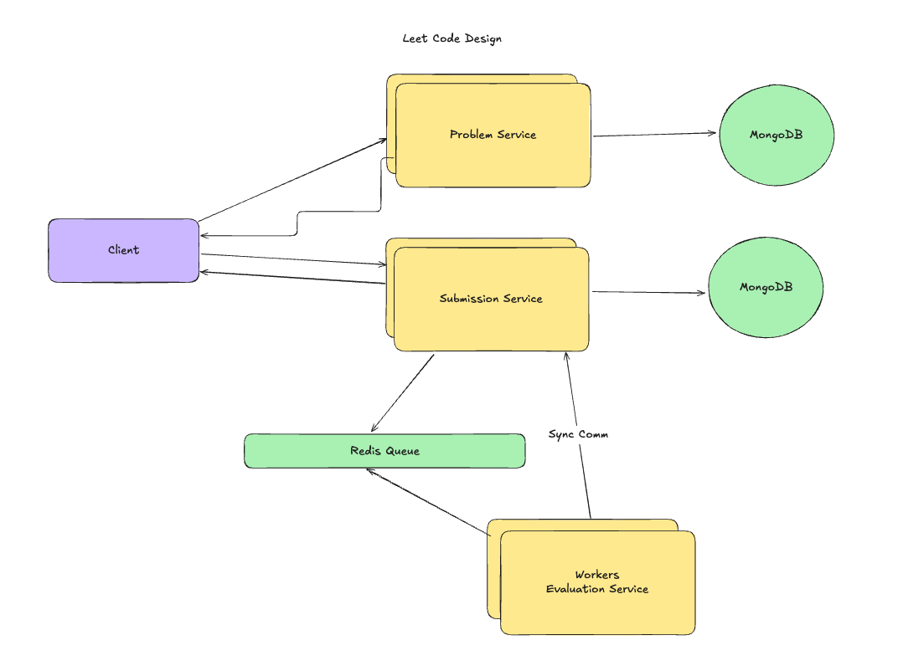

# CodeJudge

A full-stack coding platform that allows users to solve algorithmic problems and get real-time code evaluation in multiple programming languages.



## 🏗️ System Architecture

The application follows a microservices architecture with the following components:

- **Problem Service** - Manages coding problems and test cases
- **Submission Service** - Handles user submissions and tracks evaluation status
- **Evaluation Service** - Executes code in isolated Docker containers and evaluates results
- **MongoDB** - Primary database for problems and submissions
- **Redis Queue** - Message queue for asynchronous code evaluation

## ✨ Features

### Problem Management

- ✅ Create, read, update, and delete coding problems
- ✅ Support for multiple difficulty levels (Easy, Medium, Hard)
- ✅ Rich problem descriptions with Markdown support
- ✅ Custom test cases for each problem
- ✅ Search problems by title and filter by difficulty

### Code Submission & Evaluation

- ✅ Multi-language support (Python, C++, Java)
- ✅ Real-time code execution in secure Docker containers
- ✅ Automatic test case evaluation with detailed results
- ✅ Submission status tracking (Pending → Completed)
- ✅ Test case results: AC (Accepted), WA (Wrong Answer), TLE (Time Limit Exceeded)

### Infrastructure

- ✅ Scalable microservices architecture
- ✅ Asynchronous processing with Redis queues
- ✅ Container-based code execution for security
- ✅ Comprehensive logging and error handling
- ✅ Request correlation tracking across services

## 🚀 Quick Start

### Prerequisites

- Docker & Docker Compose
- Node.js 18+
- MongoDB
- Redis

### Installation

1. **Clone the repository**

   ```bash
   git clone <repository-url>
   cd leetcode
   ```

2. **Start infrastructure services**

   ```bash
   docker-compose up -d
   ```

3. **Install dependencies for all services**

   ```bash
   # Problem Service
   cd ProblemService && npm install

   # Submission Service
   cd ../SubmissionService && npm install

   # Evaluation Service
   cd ../EvaluationService && npm install
   ```

4. **Start all services**

   ```bash
   # Terminal 1 - Problem Service (Port 3000)
   cd ProblemService && npm run dev

   # Terminal 2 - Submission Service (Port 3001)
   cd SubmissionService && npm run dev

   # Terminal 3 - Evaluation Service (Port 3002)
   cd EvaluationService && npm run dev
   ```

## 📡 API Endpoints

### Problem Service (Port 3000)

- `POST /api/v1/problems` - Create a new problem
- `GET /api/v1/problems` - Get all problems
- `GET /api/v1/problems/:id` - Get problem by ID
- `PUT /api/v1/problems/:id` - Update problem
- `DELETE /api/v1/problems/:id` - Delete problem

### Submission Service (Port 3001)

- `POST /api/v1/submissions` - Submit code for evaluation
- `GET /api/v1/submissions/:id` - Get submission details
- `GET /api/v1/submissions/problem/:id` - Get submissions for a problem

### Evaluation Service (Port 3002)

- Background worker service that processes submission queue
- Communicates with Submission Service for status updates

## 🛠️ Technology Stack

**Backend:**

- Node.js with Express.js
- TypeScript for type safety
- MongoDB with Mongoose ODM
- Redis for message queuing
- Docker for containerized code execution
- Winston for logging
- Zod for validation

**Infrastructure:**

- Docker & Docker Compose
- BullMQ for job processing
- Microservices architecture

## 📊 Supported Languages

- **Python** - 2 second timeout
- **C++** - 1 second timeout
- **Java** - Coming soon

## 🔧 Configuration

Each service uses environment variables for configuration:

```bash
# Database
MONGO_URI=mongodb://localhost:27017/leetcode

# Redis
REDIS_HOST=localhost
REDIS_PORT=6379

# Service URLs
PROBLEM_SERVICE_URL=http://localhost:3000
SUBMISSION_SERVICE_URL=http://localhost:3001
EVALUATION_SERVICE_URL=http://localhost:3002
```

## 🐳 Docker Services

The `docker-compose.yml` includes:

- **MongoDB** (Port 27017) - Primary database
- **Redis** (Port 6379) - Message queue and caching

## 📝 Example Usage

1. **Create a Problem:**

   ```bash
   curl -X POST http://localhost:3000/api/v1/problems \
     -H "Content-Type: application/json" \
     -d '{
       "title": "Two Sum",
       "description": "Find two numbers that add up to target",
       "difficulty": "easy",
       "testCases": [
         {"input": "[2,7,11,15]\n9", "output": "[0,1]"}
       ]
     }'
   ```

2. **Submit Code:**

   ```bash
   curl -X POST http://localhost:3001/api/v1/submissions \
     -H "Content-Type: application/json" \
     -d '{
       "problemId": "problem_id_here",
       "code": "def two_sum(nums, target): ...",
       "language": "python"
     }'
   ```

## 🏁 Development

- Each service follows clean architecture principles
- Comprehensive error handling and validation
- Structured logging with correlation IDs
- Type-safe development with TypeScript

---

**Note:** This is a educational project demonstrating microservices architecture, containerized code execution, and real-time evaluation systems.
